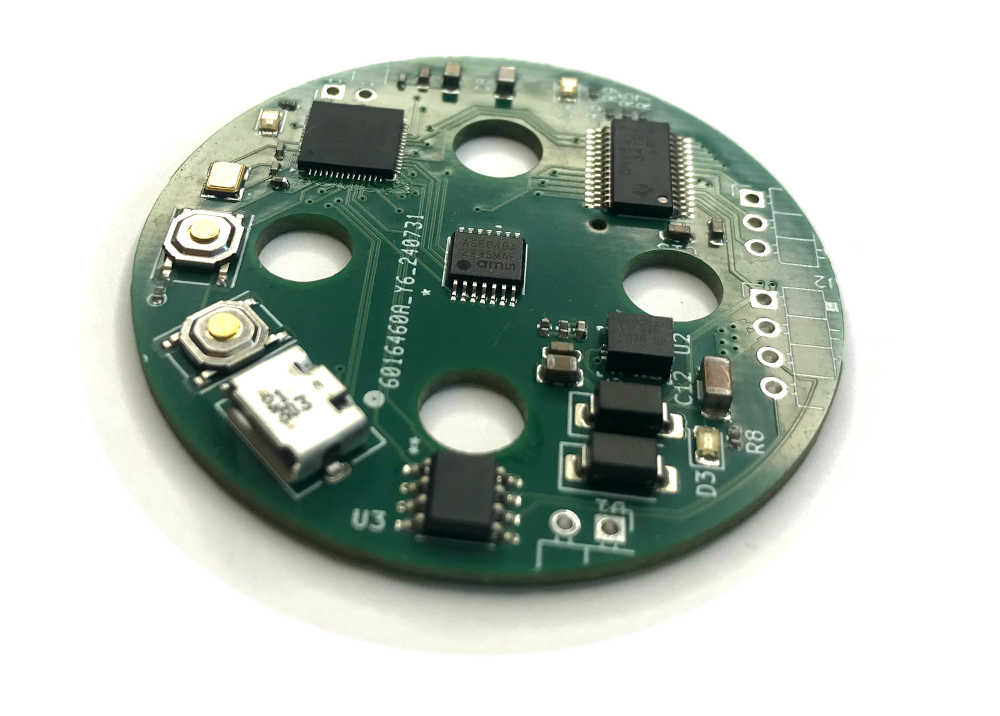
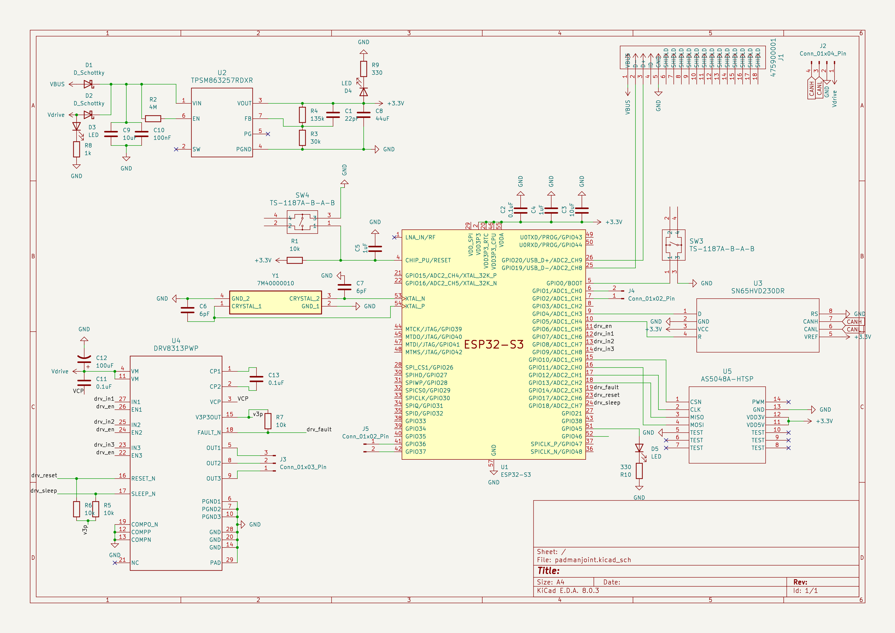

# esp32_canbus_simplefoc
A pcb design for a small esp32-based board that includes CAN bus, motor encoder and motor driver. This board can be
programmed using USB and, at runtime, simply requires 4 wires during operation: GND, 14.4V, CANH, CANL. It is designed 
this way to minimize cabling in robot arms. It is part of a small robot arm project I am currently developing. The
mounting holes are designed to directly fit a [TMotor GB4106 Motor](https://store.tmotor.com/product/gb4106-gimbal-type.html).
It's a great motor for robot arms as it has a low KV value of 53 and is rather cheap.

## Components

## Schematic

